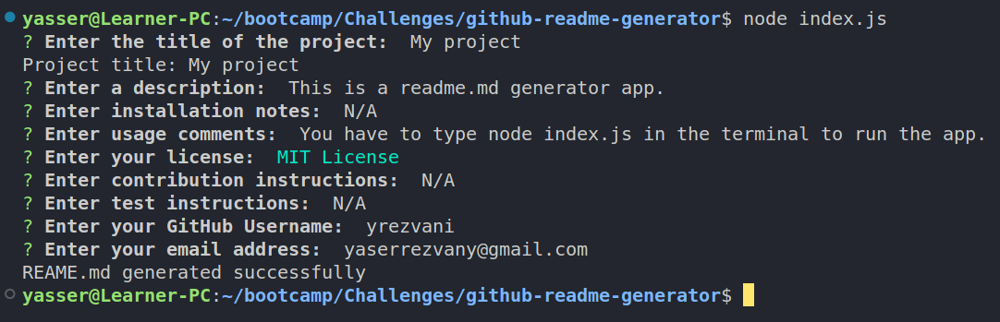
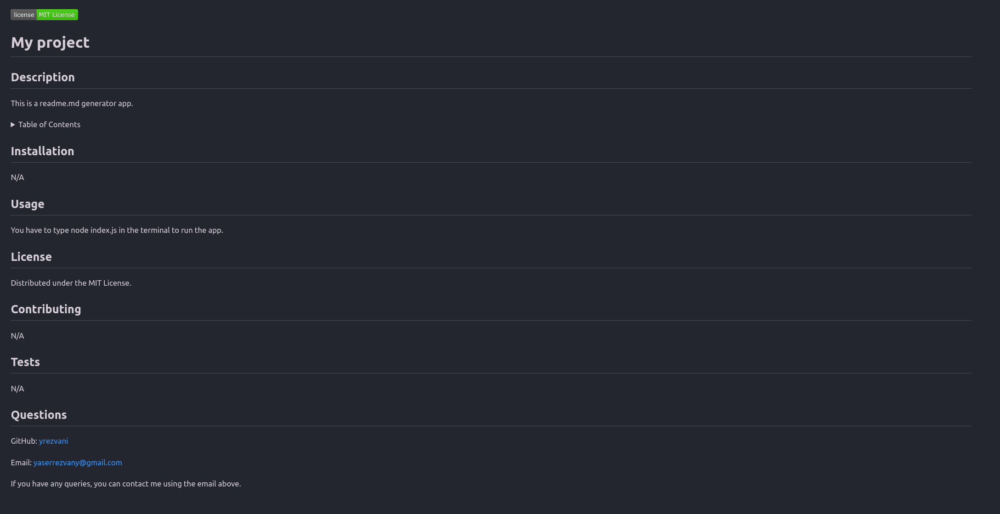

# Github Readme Generator

This app simplifies the process of adding a README.md file to your project. The app is terminal-based with not GUI. The user answers a series of prompts about their project, and a README.md file is generated based on those questions. The readme file adds a badge for the license and has a table of contents that takes the user to the right section upon clicking.

## Screenshot

## Usage

In order to use the app, you need to enter "node index.js" in the terminal. You will then get a series of prompts on the screen about your project. Once you have answered the prompts, your README.md file will be generated based on your answers.

## Video walkthrough

## Github repository

https://github.com/yrezvani/github-readme-generator

